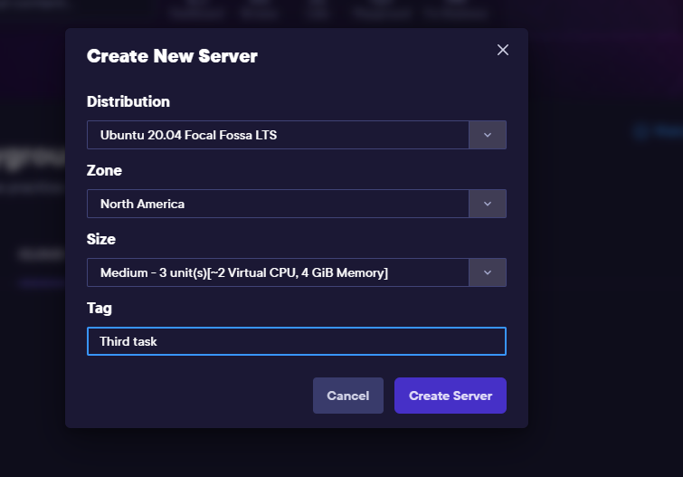
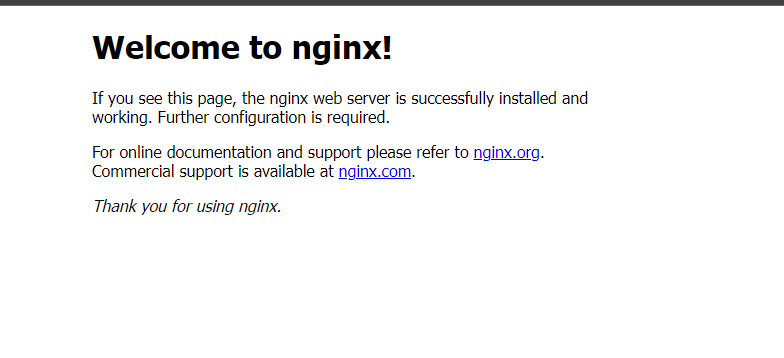

Sure, here's the README in Markdown format:

---

# TechMart Flask Application Deployment

This repository contains a simple Flask web application and all necessary scripts and configurations to automate its deployment on an Ubuntu 20.04 server using Docker, Nginx as a reverse proxy, and self-signed certificates for HTTPS access.

## Project Structure






```
my_flask_app/
│
├── app.py
├── requirements.txt
├── Dockerfile
├── docker-compose.yml
└── deploy.sh
```

### `app.py`

This is the main Flask application file.

```python
from flask import Flask

app = Flask(__name__)

@app.route('/')
def hello():
    return "Hello, TechMart!"

if __name__ == "__main__":
    app.run(host='0.0.0.0', port=5000)
```

### `requirements.txt`

This file lists the dependencies required for the Flask application.

```
Flask==2.0.1
```

### `Dockerfile`

This file contains the instructions to build the Docker image for the Flask application.

```Dockerfile
FROM python:3.9-slim

WORKDIR /app

COPY requirements.txt requirements.txt
RUN pip install -r requirements.txt

COPY . .

CMD ["python", "app.py"]
```

### `docker-compose.yml`

This file is used to define and run multi-container Docker applications. It includes the configuration for the Flask application.

```yaml
version: '3.8'

services:
  web:
    build: .
    ports:
      - "5000:5000"
    restart: always
```

### `deploy.sh`

This is the deployment script that automates the setup of Docker, Docker Compose, Nginx, and HTTPS on an Ubuntu 20.04 server.

```bash
#!/bin/bash

set -e

# Update and install necessary packages
sudo apt update
sudo apt install -y docker.io docker-compose nginx openssl git

# Clone the repository
if [ ! -d /var/www/my_flask_app ]; then
  git clone https://github.com/yourusername/my_flask_app.git /var/www/my_flask_app
fi

# Navigate to the application directory
cd /var/www/my_flask_app

# Build and run the Docker container
docker-compose down
docker-compose up -d --build

# Generate self-signed SSL certificate
sudo openssl req -x509 -nodes -days 365 -newkey rsa:2048 \
  -keyout /etc/ssl/private/nginx-selfsigned.key \
  -out /etc/ssl/certs/nginx-selfsigned.crt \
  -subj "/C=US/ST=State/L=City/O=Organization/OU=Department/CN=techmart.com"

# Create a strong Diffie-Hellman group
sudo openssl dhparam -out /etc/nginx/dhparam.pem 2048

# Configure Nginx
sudo tee /etc/nginx/sites-available/default > /dev/null <<EOL
server {
    listen 80;
    server_name techmart.com www.techmart.com;
    return 301 https://\$host\$request_uri;
}

server {
    listen 443 ssl;
    server_name techmart.com www.techmart.com;

    ssl_certificate /etc/ssl/certs/nginx-selfsigned.crt;
    ssl_certificate_key /etc/ssl/private/nginx-selfsigned.key;
    ssl_dhparam /etc/nginx/dhparam.pem;

    ssl_protocols TLSv1.2 TLSv1.3;
    ssl_prefer_server_ciphers on;
    ssl_ciphers 'ECDHE-ECDSA-AES128-GCM-SHA256:ECDHE-RSA-AES128-GCM-SHA256:ECDHE-ECDSA-AES256-GCM-SHA384:ECDHE-RSA-AES256-GCM-SHA384:ECDHE-ECDSA-CHACHA20-POLY1305:ECDHE-RSA-CHACHA20-POLY1305';

    ssl_session_timeout 1d;
    ssl_session_cache shared:MozSSL:10m;
    ssl_session_tickets off;

    add_header Strict-Transport-Security "max-age=31536000" always;
    add_header X-Content-Type-Options nosniff;
    add header X-Frame-Options DENY;
    add_header X-XSS-Protection "1; mode=block";

    location / {
        proxy_pass http://127.0.0.1:5000;
        proxy_set_header Host \$host;
        proxy_set_header X-Real-IP \$remote_addr;
        proxy_set_header X-Forwarded-For \$proxy_add_x_forwarded_for;
        proxy_set_header X-Forwarded-Proto \$scheme;
    }
}
EOL

# Restart Nginx
sudo systemctl restart nginx

echo "Deployment completed successfully."
```


